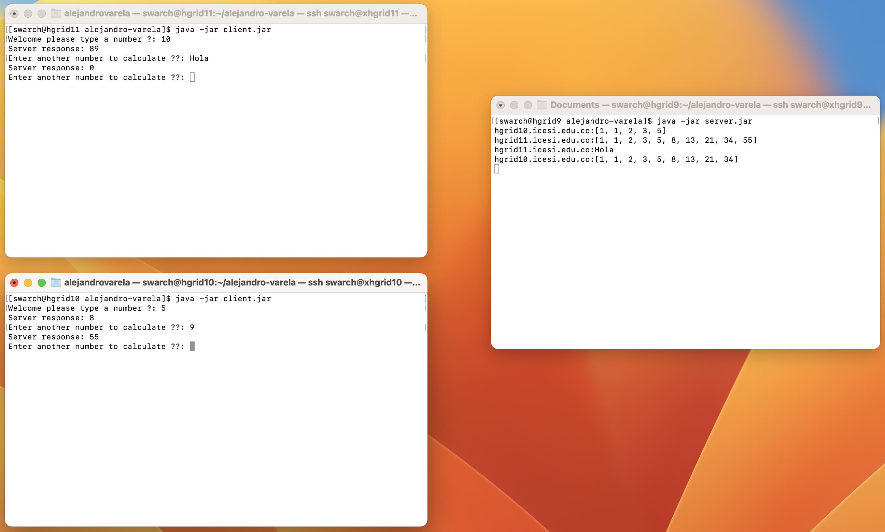
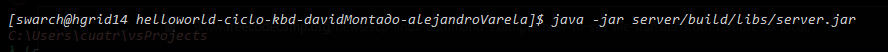
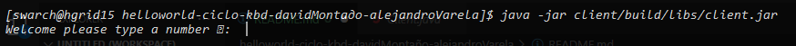
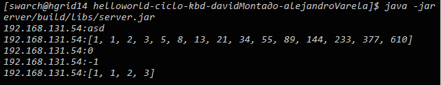
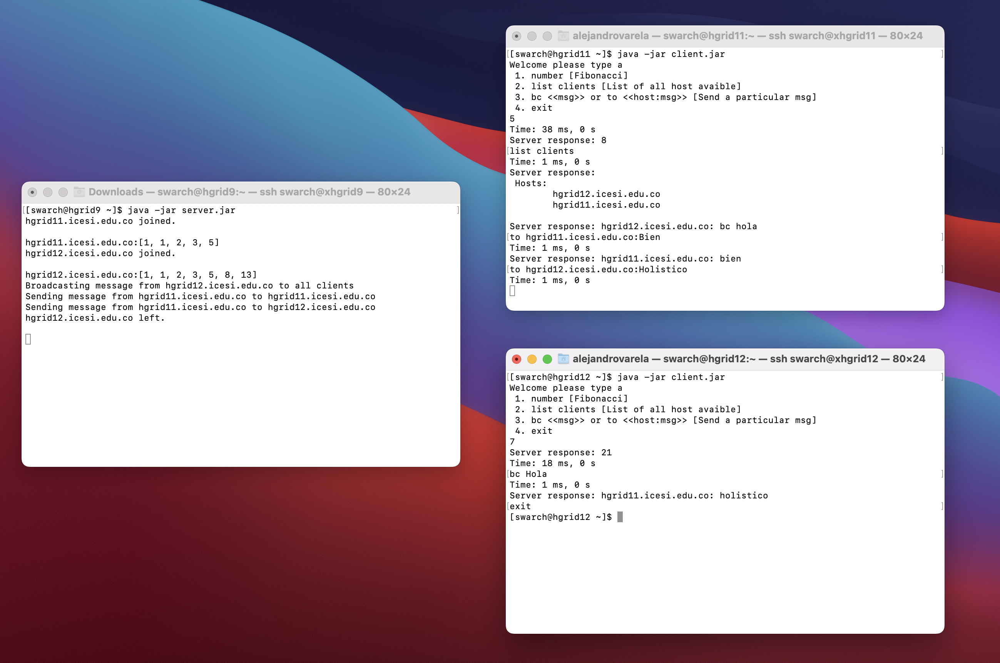

# Ice Middleware - Fibonacci Calculator 🎁

Distributed programming to calculate the fibonacci sequence. The Fibonacci numbers, commonly denoted Fn , form a sequence, the Fibonacci sequence, in which each number is the sum of the two preceding.

## Build With 🛠️

<div align="left">
    <p>
        <a href="https://code.visualstudio.com" target="_blank"> </a>
        <a href="https://code.visualstudio.com" target="_blank"> </a>
        <a href="https://gradle.org" target="_blank"> </a>
    </p>
</div>

## Versioned 📌

<div align="left">
    <a href="https://git-scm.com/" target="_blank"> </a>
    <a href="https://github.com/" target="_blank"> </a>
</div>

## Configuration 💾

We're going to use a project with two sub-projects to build the Client and Server applications. The requirements for our sub-projects are the same so we'll do all the setup in the subprojects block of the root project, which applies to all sub-projects. Edit the generated build.gradle file to look like the one below:

```gradle
...
"Class-Path": configurations.runtimeClasspath.resolve().collect { it.toURI() }.join(' ')
...
```

In order for it to be independent of the computer on which it is developed, it should look like this:

```gradle
...
"Class-Path": 'opt/Ice-3.7.6/lib/ice-3.7.6.jar'...
```

We must also edit the generated settings.gradle to define our sub-projects:

```gradle
rootProject.name = 'ice'
include 'client'
include 'server'
```

Besides that, we must edit the file config.server located in server/src/main/resources with the host and port where the server will be deployed, the default server values are these:

```properties
Printer.Endpoints=tcp -p 9099
Ice.Default.Host=localhost
```

Finally, we must edit the file config.client located in client/src/main/resources with the values of the server we want to communicate, the default client values are these:

```properties
Printer.Proxy=SimplePrinter:tcp -p 9099
Callback.Client.Endpoints=default -h localhost
Ice.Default.Host=localhost
```

As an **observation**, if you want to run our product remotely, you must change the resource file that is inside the jar (zip) and you must modify the host by the ip and port where the logical interface of your computer is located. We will place an example of how we do it using zerotier as a logical interface identifying the server on the xhgrid9 pc.


### Server

- For your local pc

```properties
Ice.Default.Host=10.147.19.125
```
- For remotes pc

```properties
Ice.Default.Host=192.168.131.49 # hgrid9.icesi.edu.co (DNS resolves ip)
```
### Client

- In your local pc

```properties
Callback.Client.Endpoints=default -h 10.147.19.218 # Your ip in zerotier logic interface
Ice.Default.Host=10.147.19.125 # xhgrid9 (DNS resolves ip)
```

- In remote pc

```properties
Callback.Client.Endpoints=default -h 192.168.131.51 # Or hotsname specific of the remote client (hgrid11.icesi.edu.co)
Ice.Default.Host=hgrid9
```

### Notes 📑

Sending jar files using scp command:

```bash
scp server.jar swarch@xhgrid9:.
scp client.jar swarch@xhgrid10:.
scp client.jar swarch@xhgrid11:.
```

## Compiling the client and server ⭐️

```bash
gradle build
```

## Running product remotely 💥

```bash
java -jar server/build/libs/server.jar 
java -jar client/build/libs/client.jar 
```


## Testing our distributed app local 🐙

- To run client and server, we first start the server in a separate window:
  
- At this point, we wont see anything because the server simply waits for a client to connect to it. We run the client in a different window:
  

Some examples of the client and server communication are documentated below:

* Client:
  
* Server:
  

To get rid of the server, we interrupt it on the command line for now. And, to get rid of the client you must write **exit**.

# Second part 📦

## Part I: Implement bash or a simple scheme (e.g., writing to a file) that allows

1. Determine the number of clients such that, when sending their messages at the same time to calculate the Fibonacci series of large numbers, the timeout exception begins to appear.

2. Demonstrate how the server responds when many clients send messages at the same time with large integers (i.e., there is or is not concurrency).

## Part II: Modify the server

1. Multi-threaded so that it can respond to multiple requests from different clients, concurrently. Is this concurrency virtual or is it real? how can you prove it? Attach a screenshot of the test.

2. Answer, with this new version, the two points of Part I.

3. To allow a client to "register", with the hostname and what is necessary for them to make a callback.

4. Regarding the messages, if the received message:
    a. Starts with "list clients", it should return the list of clients (hostnames or their prefix) registered on the server.
    b. Starts with "to X:", it should send the remainder of the message to X, where X is the destination hostname (or its prefix).
    c. Starts with "BC" (broadcast), the message must be returned by the server to ALL clients registered with it.


## **Authors** ✒️

<div align="left">
    <a href="https://github.com/alejandro945" target="_blank"> </a>
    <a href="https://github.com/gabrielSB19" target="_blank"> </a>
</div>

---

[](https://forthebadge.com) [](https://forthebadge.com)
