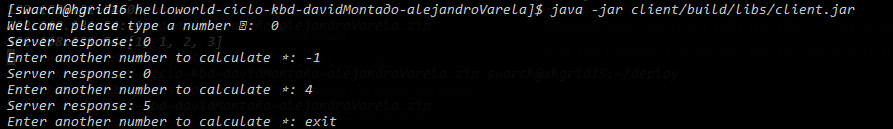

# Ice Middleware - Fibonacci Calculator 🎁

Distributed programming to calculate the fibonacci sequence. The Fibonacci numbers, commonly denoted Fn , form a sequence, the Fibonacci sequence, in which each number is the sum of the two preceding.

## Build With 🛠️

<div align="left">
    <p>
        <a href="https://code.visualstudio.com" target="_blank"> </a>
        <a href="https://code.visualstudio.com" target="_blank"> </a>
        <a href="https://gradle.org" target="_blank"> </a>
    </p>
</div>

## Versioned 📌

<div align="left">
    <a href="https://git-scm.com/" target="_blank"> </a>
    <a href="https://github.com/" target="_blank"> </a>
</div>

## Configuration 💾

We're going to use a project with two sub-projects to build the Client and Server applications. The requirements for our sub-projects are the same so we'll do all the setup in the subprojects block of the root project, which applies to all sub-projects. Edit the generated build.gradle file to look like the one below:

```gradle
...
"Class-Path": configurations.runtimeClasspath.resolve().collect { it.toURI() }.join(' ')
...
```

In order for it to be independent of the computer on which it is developed, it should look like this:

```gradle
...
"Class-Path": 'opt/Ice-3.7.6/lib/ice-3.7.6.jar'...
```

We must also edit the generated settings.gradle to define our sub-projects:

```gradle
rootProject.name = 'ice'
include 'client'
include 'server'
```

Besides that, we must edit the file config.server located in server/src/main/resources with the host and port where the server will be deployed, the default server values are these:

```properties
Printer.Endpoints=tcp -p 9099
Ice.Default.Host=localhost
```

Finally, we must edit the file config.client located in client/src/main/resources with the values of the server we want to communicate, the default client values are these:

```properties
Printer.Proxy=SimplePrinter:tcp -p 9099
Callback.Client.Endpoints=default -h localhost
Ice.Default.Host=localhost
```

As an **observation**, if you want to run our product remotely, you must change the resource file that is inside the jar (zip) and you must modify the host by the ip and port where the logical interface of your computer is located. We will place an example of how we do it using zerotier as a logical interface identifying the server on the xhgrid9 pc.

### Server

- For your local pc

```properties
Ice.Default.Host=10.147.19.125
```

- For remotes pc

```properties
Ice.Default.Host=192.168.131.49 # hgrid9.icesi.edu.co (DNS resolves ip)
```

### Client

- In your local pc

```properties
Callback.Client.Endpoints=default -h 10.147.19.218 # Your ip in zerotier logic interface
Ice.Default.Host=10.147.19.125 # xhgrid9 (DNS resolves ip)
```

- In remote pc

```properties
Callback.Client.Endpoints=default -h 192.168.131.51 # Or hotsname specific of the remote client (hgrid11.icesi.edu.co)
Ice.Default.Host=hgrid9
```

### Notes 📑

Sending jar files using scp command:

```bash
scp server.jar swarch@xhgrid9:.
scp client.jar swarch@xhgrid10:.
scp client.jar swarch@xhgrid11:.
```

## Compiling the client and server ⭐️

```bash
gradle build
```

## Running product remotely 💥

```bash
java -jar server/build/libs/server.jar
java -jar client/build/libs/client.jar
```


## Testing our distributed app local 🐙

- To run client and server, we first start the server in a separate window:
  
- At this point, we wont see anything because the server simply waits for a client to connect to it. We run the client in a different window:
  

Some examples of the client and server communication are documentated below:

- Client:
  
- Server:
  

To get rid of the server, we interrupt it on the command line for now. And, to get rid of the client you must write **exit**.

# Second part 📦

## Part I: Implement bash or a simple scheme (e.g., writing to a file) that allows

**La implementación de la parte I estará en la rama callback-part-I, para ir a esta rama hacer clcik <a href="https://github.com/alejandro945/ice-fibonacci/tree/callback-part-I">aquí</a>**

**Observación importante:** Para poder ejecutar los scripts de bash, se debe tener instalado el paquete de **sshpass**. Si se esta en un sistema operativo Linux, ejecutar:

```bash
sudo apt-get install sshpass
```
If the execution environment is Windows, you must execute the .sh through the **Cygwin** terminal with the sshpass package installed or from a **WSL** execution environment with the sshpass package installed.

1. Determine the number of clients such that, when sending their messages at the same time to calculate the Fibonacci series of large numbers, the timeout exception begins to appear.

2. Demonstrate how the server responds when many clients send messages at the same time with large integers (i.e., there is or is not concurrency).

### Building our project
- To build our project, we must execute the following command:
```bash
gradle build
```

- Once the project is built, our project will already have the .Jar files ready to run the clients and the server. The first thing we must do is to execute the script that will send the .Jar files to the corresponding machines. For this, we must execute the following command:
```bash
./deploy.sh $1
```

Where "$1" is a string containing the ids of the machines to which the .Jar will be sent (Clients). To send the script to several machines we must separate the ids by commas. For example, if we want to send the script to machines 4,5,6 and 7, we must execute the following command:
```bash
./deploy.sh 4,5,6,7
```

The .Jar from the server will always be sent to machine 2.

- Run the server on machine 2. To do this, we must execute the following series of commands, from connecting remotely to machine 2, to running the server's .Jar:
```bash
ssh swarch@xhgrid2
cd GabrielSuarez-AlejandroVarela-CallBack
./deployServer.sh
```

- To run the clients, the deployServer script must be running and the Server must be running. Server must be running. Once this is done, we can move on to running the clients. To run the clients, the following command must be executed:
```bash
./deployClient.sh $1 $2
```

Where **$1** must be equal to the value that was passed in the deploy.sh and **$2** must be equal to the numbers with which you want to perform the fibonacci, like the clients, can be more than one number separated by commas, for example, if you want to run the fibonacci of the number 10 you must run the following command taking into account the clients mentioned above:
```bash
./deployClient 4,5,6,7 10
```

- With this we will already have automated the execution of our system, to see the results of the server after the execution, you must go to the machine 2 and execute the following command:
```bash
ssh swarch@xhgrid2
cd GabrielSuarez-AlejandroVarela-CallBack
cat server.log
```
Now to see the result of the clients, we will only look at the **client.log** file that will be stored at the same level of the deploy .sh.

**To see the analysis and the conclusion reached after automating the process go to the following <a href="./docs/Analisis del TimeOut - No concurrencia.pdf">link<a>**

## Part II: Modify the server

1. Multi-threaded so that it can respond to multiple requests from different clients, concurrently. Is this concurrency virtual or is it real? how can you prove it? Attach a screenshot of the test.

2. Answer, with this new version, the two points of Part I.

3. To allow a client to "register", with the hostname and what is necessary for them to make a callback.

4. Regarding the messages, if the received message:
   a. Starts with "list clients", it should return the list of clients (hostnames or their prefix) registered on the server.
   b. Starts with "to X:", it should send the remainder of the message to X, where X is the destination hostname (or its prefix).
   c. Starts with "BC" (broadcast), the message must be returned by the server to ALL clients registered with it.


## **Authors** ✒️

<div align="left">
    <a href="https://github.com/alejandro945" target="_blank"> </a>
    <a href="https://github.com/gabrielSB19" target="_blank"> </a>
</div>

---

[](https://forthebadge.com) [](https://forthebadge.com)
